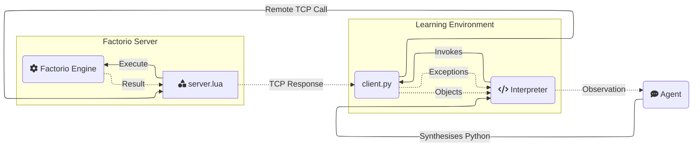

## 环境
FLE 是基于热门的资源管理模拟游戏 Factorio 构建的智能体评估环境。

智能体通过与 **FLE** 进行代码合成，遵循 **REPL**（读取-求值-打印-循环）模式进行交互：

1. **观察**：智能体通过其最后程序的输出流（stderr/stdout）观察世界。
2. **行动**：智能体生成一个 Python 程序以执行所需的动作。
3. **反馈**：环境执行该程序，为变量赋值，向命名空间添加类/函数，并提供输出流。

<!DOCTYPE html>

<html>
<body>
<table>
<tr>

<td class="python-code">
<b>行动</b>
<pre>
# 1. 获取铁矿石区块并放置采矿钻头
drill = place_entity(
    entity=Prototype.MiningDrill,
    position=nearest(Prototype.IronOre)),
    direction=Direction.NORTH
)
# 2. 添加输出存储
chest = place_entity_next_to(
    entity=Prototype.IronChest,
    reference_position=drill.drop_position,
    direction=Direction.SOUTH
)
# 3. 验证自动化链并观察实体
sleep(10) # 暂停 10 秒
assert drill.status == EntityStatus.WORKING
print(get_entities())
</pre>
</td>
<td class="bash-code">
<b>反馈</b>
<pre>
>>> [ BurnerMiningDrill(fuel=Inventory({'coal': 4}), 
>>>                     name='burner-mining-drill', 
>>>                     direction=Direction.DOWN, 
>>>                     position=Position(x=-28.0, y=-61.0), 
>>>                     energy=2666.6666666667, 
>>>                     tile_dimensions=TileDimensions(tile_width=2.0, tile_height=2.0), 
>>>                     status=EntityStatus.WORKING, 
>>>                     neighbours=[Entity(name='iron-chest', direction=DOWN, position=Position(x=-27.5 y=-59.5)], 
>>>                     drop_position=Position(x=-27.5, y=-59.5), 
>>>                     resources=[Ingredient(name='iron-ore', count=30000, type=None)]),
>>>   Chest(name='iron-chest', 
>>>         direction=Direction.UP, 
>>>         position=Position(x=-27.5, y=-59.5), 
>>>         energy=0.0, 
>>>         tile_dimensions=TileDimensions(tile_width=1.0, tile_height=1.0), 
>>>         status=EntityStatus.NORMAL, 
>>>         inventory=Inventory({'iron-ore': 75}))]
</pre>
</td>
</tr>
</table>
</body>
</html>

智能体可以使用 Python 标准库以及一个由[工具](##tool-documentation)组成的 API。

工具是执行游戏动作并返回一个类型化对象（例如一个 Inventory）的函数，该对象可以作为 Python 命名空间中的一个命名 **变量** 存储起来以供后续使用。

命名空间充当一个场景化的符号记忆系统，保存的对象代表了查询时刻环境的观察结果。

这使得智能体能够维持复杂的状态表示，并在工厂规模扩大时构建分层抽象。

智能体观察 **stdout** 和 **stderr** - 也就是他们程序的输出流。智能体可以选择有意识地打印相关对象和计算到输出流中，以构建观察结果。

代码中的错误或无效操作会引发带有详细上下文的类型化 **异常**，并写入 stderr。

这使得智能体能够在执行后反应性地调试他们的程序，并在执行期间主动使用运行时断言自我验证其行为。

智能体可以通过定义以下内容来增强对游戏状态的内部表示：

1. 在整个场景中重用的实用函数，封装先前成功的逻辑
2. 在命名空间中定义类以更好地组织从游戏中检索的数据。

## 智能体
Factorio 学习环境为开发和评估能够玩 Factorio 的 AI 模型提供了一个简单的智能体架构。

智能体在 *场景* 中运作，每个步骤涉及观察、规划和通过 Python 代码合成执行动作。
智能体通过包含其行动（_assistant_）和环境 stdout/stderr（_user_）的对话历史来维持状态。
在每一步，智能体生成 Python 代码策略，在环境中执行。

### 智能体的结构
智能体位于 `agents` 中，并实现一个定义了与环境交互核心接口的抽象基类（AgentABC）。

抽象基类定义了所有智能体都必须实现的两个方法：

```
# Generates the next action based on conversation history and environment response (including score / achievements etc).
step(conversation: Conversation, response: Response) -> Policy:

# Handles cleanup when an episode terminates, i.e for reporting results etc.
end(conversation: Conversation, completion: CompletionState) -> None:
```


每个代理接收一个任务（下一节将会讨论）作为输入，该任务指定了代理的目标。

我们的默认代理是 `BasicAgent`，它融合了一些基本机制来在长达1000步以上的运行中管理上下文：

1. 每32步，系统中所有较老的交互会被汇总成一份报告。
2. 对话会被剪辑，以保持在20万字符以下（约8.7万个标记）。
3. 我们移除所有游戏实体的历史观察数据，因为这既会填满上下文，也会使代理感到困惑。

我们包含了一些基本的工具来调用不同的语言模型（`agents/utils/llm_factory.py`），用于格式化对话历史（`agents/utils/formatters/conversation_formatter_abc.py`），以及用于将响应解析成有效的Python代码（`agents/utils/parse_response.py`）。

### 最小化代理示例

```python
# ./agents/minimal_agent.py

class MinimalAgent(AgentABC):
    """
    This is a minimal Agent implementation, which takes the current conversation (including the most recent response)
    and generates a simple Python code policy to execute the next step.
    
    Note: This will blow up context length on longer runs, without some context pruning/management.
    """
    def __init__(self, model, system_prompt, goal_description, *args, **kwargs):
        system_prompt += f"\n\n### Goal\n{goal_description}\n\n"
        super().__init__(model, system_prompt, *args, **kwargs)
        self.llm_factory = LLMFactory(model)
    
    @tenacity.retry(
       retry=retry_if_exception_type(Exception),
       wait=wait_exponential(multiplier=1, min=4, max=10)
    )
    async def step(self, conversation: Conversation, response: Response) -> Policy:
        # Generate and return next policy
        response = await self.llm_factory.acall(
           messages=self.formatter.to_llm_messages(conversation),
           n_samples=1,  # We only need one program per iteration
           temperature=self.generation_params.temperature,
           max_tokens=self.generation_params.max_tokens,
           model=self.generation_params.model,
       )
        
       # Parse LLM response into a Policy object
       policy = parse_response(response)
       if not policy:
           raise Exception("Not a valid Python policy")

       return policy

    async def end(self, conversation: Conversation, completion: CompletionResult):
        pass
```


## 任务

每个代理都会被赋予一个 `task`（任务），该任务明确了代理在FLE中将要执行的目标。一个任务包括一个定义了任务类别核心接口的任务对象和一个指定任务参数的json文件。

### 任务结构

任务存放在 `eval/tasks` 目录下，并实现了位于 `eval/tasks/task_abc.py` 的一个抽象基类。该基类定义了设置任务、搭建环境以及验证成功的核心接口。

抽象基类规定了所有任务都必须实现的三个方法：

```
verify(self, score: float, step: int, instance: FactorioInstance, step_statistics: Dict) -> bool:
""" Return true if the task is completed"""

setup_instance(self, instance):
"""Code to provision the initial game state for the task environment"""

enhance_response_with_task_output(self, response: str, task_response: TaskResponse) -> str:
"""Add task specific information to the environment response if needed"""

```


我们提供了两个默认任务：

1. OpenPlayTask - 针对开放游玩设置的任务，代理在此任务中玩游戏直到完成指定的步数。验证函数将始终返回False。
2. ThroughputTask - 需要代理在预留期间构建一个达到特定产量的工厂的任务。如果预留期间的产量超过阈值，验证函数将返回True。

任务JSON文件指定了“task_type”和“config”参数。`task_type`指定了从JSON到任务类型（从JSON创建任务对象的过程在`eval\tasks\task_factory.py`中完成）的映射。`config`指定了构成相应任务对象所需的所有属性。每个配置至少必须定义“goal_description”、“trajectory_length”和“task_key”参数。
以下是任务JSON的示例：

```
# Open play task json

{   "task_type": "default",
    "config": {                         
        "goal_description":"- Build the biggest possible factory\n- Maximise automation, efficiency and scale",
        "trajectory_length": 5000,
        "task_key": "open_play"
    }
}
# One example of a throughput task json
{                          
    "task_type": "throughput",
    "config":
        {"goal_description":"Create an automatic iron gear wheel factory that produces 16 iron gear wheel per 60 ingame seconds",
        "throughput_entity":"iron-gear-wheel",
        "quota":16,
        "trajectory_length": 128,
        "holdout_wait_period": 60,
        "pre_holdout_wait_period": 60,
        "task_key": "iron_gear_wheel_throughput_16"}

}
```


以下是可以看到的示例开放性游戏任务对象。吞吐量任务对象可在 `eval/tasks/throughput_task.py` 处找到。

```
class OpenPlayTask(TaskABC):
    def __init__(self, trajectory_length, goal_description: str, task_key: str):
        super().__init__(trajectory_length, starting_inventory = {}, goal_description=goal_description, task_key = task_key)
        self.starting_game_state = None
        
    
    def verify(self, score: float, instance: FactorioInstance, step_statistics: Dict) -> TaskResponse:
        return TaskResponse(success = False,
                            meta = {})
            
    def _to_dict(self) -> Dict[str, Any]:
        return {
            "goal_description": self.goal_description,
            "trajectory_length": self.trajectory_length,
            "starting_inventory": self.starting_inventory,
            "initial_state": self.starting_game_state.to_raw() if self.starting_game_state else None,
        }

    def setup_instance(self, instance):
        """Code to provision the task environment"""
        pass
```


### 运行任务
运行任务的入口是 `eval/open/independent_runs/run.py`，该脚本读取一个运行配置的 JSON 文件，并行执行指定的任务，并将每个生成的程序及其环境输出和任务验证结果保存到数据库中。运行配置 JSON 文件的位置通过 `--run_config` 命令行参数传递。如果没有传递参数，则使用默认的运行配置 `eval/open/independent_runs/run_config.json`。

运行配置 JSON 是一个字典列表，指定了 task_json 的位置、模型及版本（可选）。以下是一个并行运行 3 个任务的示例。

```
[
{"task": "iron_gear_wheel_throughput_16.json",
"model": "gpt-4o-mini-2024-07-18",
"version": 768},
{"task": "plastic_bar_throughput_16.json",
"model": "anthropic/claude-3.5-sonnet-open-router"},
{"task": "open_play.json",
"model": "gpt-4o-mini-2024-07-18"}
]

```


每个任务都会持续运行，直到 `verify` 函数返回 True 或达到最大步数（`trajectory_length`）。

## 工具文档
代理通过使用 _工具_ 与游戏互动，这些工具为游戏提供了一个狭窄的 API 接口。

### 工具结构
工具位于 `env/src/tools` 目录中，可以是 `admin` 工具（不可由代理访问）或 `agent` 工具（由代理使用）。

一个工具需要以下三个文件：

1. `agent.md`：工具的代理文档，包括使用模式、最佳实践和失败模式。
2. `client.py`：客户端实现，是一个可以被代理调用的 Python 类。
3. `server.lua`：服务器端实现，负责处理大部分逻辑和繁重工作。




### 创建自定义工具
1. 在 `env/src/tools/agent` 目录下创建一个新的文件夹，例如 `env/src/tools/agent/my_tool`。
2. 添加一个 `client.py` 文件，文件中应包含一个继承自 `Tool` 的类并实现 `__call__` 函数以使该类作为可调用函数。方法签名中应包含类型注解。此函数**必须**调用 `self.execute` 以触发服务器端逻辑。
3. 添加一个 `server.lua` 文件，文件中包含一个结构类似于 `global.actions.my_tool = function(arg1, arg2, ...)` 的函数。这个文件应调用 [Factorio API](https://lua-api.factorio.com/1.1.110/) 来执行期望的操作，并返回一个将被序列化并传回客户端的表格。
4. 添加一个 `agent.md` 文件，其中应包含关于该工具的 Markdown 格式描述。这个文件将被代理用来了解如何使用该工具。

下次运行评估时，该工具将自动可供代理使用，并在代理上下文中记录。

5. （可选）在 `env/tests/actions` 目录下为你的新工具创建一个测试套件。

### 核心工具
| 工具 | 描述 | 关键特性 |
|------|--------------------------------------------------|--------------|
| `inspect_inventory` | 检查玩家或实体库存内容 | - 支持各种库存类型（箱子、熔炉等）<br>- 返回带计数方法的 Inventory 对象<br>- 可查询特定物品 |
| `insert_item` | 将玩家库存中的物品放入实体 | - 适用于机器、箱子、输送带<br>- 验证物品兼容性<br>- 返回更新后的实体 |
| `extract_item` | 从实体库存中移除物品 | - 支持所有库存类型<br>- 自动转移到玩家库存<br>- 返回提取的数量 |
| `place_entity` | 在世界中放置实体 | - 处理方向和位置<br>- 验证放置要求<br>- 返回放置的 Entity 对象 |
| `place_entity_next_to` | 相对于其他实体放置实体 | - 自动间距/对齐<br>- 处理实体尺寸<br>- 支持所有实体类型 |
| `pickup_entity` | 从世界中移除实体 | - 将物品返回到库存<br>- 处理实体组<br>- 支持所有可放置物品 |
| `rotate_entity` | 更改实体朝向 | - 影响实体行为（例如，插入器方向）<br>- 验证旋转规则<br>- 返回更新后的实体 |
| `get_entity` | 获取位置上的实体对象 | - 更新陈旧引用<br>- 返回类型化的 Entity 对象<br>- 处理所有实体类型 |
| `get_entities` | 在区域内查找多个实体 | - 支持按类型过滤<br>- 返回 List[Entity] 对象<br>- 将连接的实体分组 |
| `nearest` | 定位最近的资源/实体 | - 查找矿石、水、树木<br>- 返回 Position 对象<br>- 500 格搜索半径 |
| `get_resource_patch` | 分析资源沉积 | - 返回大小和边界<br>- 支持所有资源类型<br>- 包含总资源量 |
| `harvest_resource` | 从世界中收集资源 | - 支持矿石、树木、岩石<br>- 自动收集到库存<br>- 返回收集的数量 |
| `connect_entities` | 在实体之间创建连接 | - 处理输送带、管道、电力<br>- 自动路径查找<br>- 返回连接组 |
| `get_connection_amount` | 计算所需的连接物品数量 | - 预规划工具<br>- 适用于所有连接类型<br>- 返回所需物品计数 |
| `set_entity_recipe` | 配置机器制作配方 | - 适用于装配机/化工厂<br>- 验证配方要求<br>- 返回更新后的实体 |
| `get_prototype_recipe` | 获取制作要求 | - 显示原料/产品<br>- 包含制作时间<br>- 返回 Recipe 对象 |
| `craft_item` | 从组件创建物品 | - 处理递归制作<br>- 验证技术要求<br>- 返回制作数量 |
| `set_research` | 启动技术研究 | - 验证先决条件<br>- 返回所需原料<br>- 处理研究队列 |
| `get_research_progress` | 监控研究状态 | - 显示剩余要求<br>- 跟踪进度百分比<br>- 返回原料列表 |
| `move_to` | 将玩家移至位置 | - 绕过障碍物进行路径查找<br>- 移动过程中可放置物品<br>- 返回最终位置 |
| `nearest_buildable` | 查找有效的建筑位置 | - 尊重实体尺寸<br>- 处理资源要求<br>- 返回可建筑位置 |
| `sleep` | 暂停执行 | - 等待动作完成<br>- 适应游戏速度<br>- 最大持续时间为15秒 |
| `launch_rocket` | 控制火箭发射井发射 | - 验证发射要求<br>- 处理发射序列<br>- 返回更新后的发射井状态 |
| `print` | 将调试信息输出到标准输出 | - 支持多种对象类型<br>- 用于监控状态<br>- 返回格式化字符串 |

# 项目结构
下面是项目结构的概览。一些目录还包含更详细的自述文件。

```
factorio-learning-environment/
├── agents/                            # Factorio Learning Environment
│     ├── utils/                          # Some utilities for building an agent
│     ├── agent_abc.py                    # Abstract class to extend
│     └── basic_agent.py                  # Agent implementation we used for our experiments
├── env/                            # Factorio Learning Environment
│     ├── src/                          # Main implementation
│     │     ├── exceptions/                 # Custom exceptions (WIP)
│     │     ├── gym/                        # Gym environment wrapper (deprecated but possibly useful)
│     │     ├── lib/                        # General purpose Lua utilities (e.g serialization etc)
│     │     ├── models/                     # Core objects used during eval
│     │     ├── rcon/                       # RCON wrapper for communicating with the game
│     │     ├── tools/                      # Agent and admin tools
│     │     │    ├── admin/                     # ~17 Tools for managing state, persistence, scoring etc 
│     │     │    └── agent/                     # ~27 Tools that the agent can use
│     │     ├── utils/                      # Python utilities
│     │     ├── entities.py                 # Python object model of the game entities
│     │     ├── game_types.py               # Technologies, Recipes, Resources
│     │     ├── instance.py                 # Environment state manager
│     │     └── namespace.py                # Namespace the agent can read/write variables to. 
│     └── tests/                        # ~350 test cases
├── cluster/                        # Everything needed to launch Factorio servers
│     ├── docker/                       # Docker container definition of the Factorio server
│     │     ├── config/                     # Factorio server configuration files
│     │     └── mods/                       # Mods (deprecated)
│     ├── local/                        # Tools for dynamically creating Docker Compose files for clusters
│     ├── remote/                       # Tools for deploying Factorio clusters onto AWS 
│     └── scenarios/                    # Factorio scenarios for Lab-play and Open-play
│         ├── default_lab_scenario/
│         └── open_world/
├── data/                           # Miscellaneous data
│     ├── blueprints_to_policies/       # Code to scrape Factorio blueprint sites and create Python policies
│     ├── icons/                        # Icons for Factorio entities and items
│     ├── prompts/                      # Prompts (deprecated)
│     ├── recipes/                      # Factorio recipes in JSONL format
│     └── scripts/                      # Misc Lua scripts (deprecated)
├── docs/                           # Website
│     └── assets/                       # Videos / Images
└── eval/
      ├── open/                     # Implementations for running agents in the open game
      │     ├── beam/                   # Implementation for Beam sampling
      │     ├── independent_runs/       # Implementation for independent eval runs
      │     ├── mcts/                   # Implementation for MCTS sampling
      │     └── plots/                  # Run results and plots
      └── tasks                     # Implementations for running agents against lab-play tasks
            ├── task_definitions/       # JSON definition of task
            ├── task_abc.py             # Abstract task definition
            └── throughput_task.py      # A basic task checking for a production throughput quota
```


## 数据库
在FLE中运行长轨迹时，我们支持在每个智能体步骤使用SQL数据库进行检查点存储。`db_client` 实现了保存和加载智能体输出、环境反馈、游戏状态以及当前轨迹历史的接口。我们支持开箱即用的Postgres和SQLite数据库。设置与FLE兼容的数据库最简单的方法是使用SQLite并设置程序表：

```
# create the db file
sqlite3 mydatabase.db

# create the programs table
CREATE TABLE programs (
    id INTEGER PRIMARY KEY AUTOINCREMENT,
    code TEXT NOT NULL,
    value REAL DEFAULT 0.0,
    visits INTEGER DEFAULT 0,
    parent_id INTEGER,
    state_json TEXT,
    conversation_json TEXT NOT NULL,
    completion_token_usage INTEGER,
    prompt_token_usage INTEGER,
    token_usage INTEGER,
    response TEXT,
    holdout_value REAL,
    raw_reward REAL,
    version INTEGER DEFAULT 1,
    version_description TEXT DEFAULT '',
    model TEXT DEFAULT 'gpt-4o',
    meta TEXT,
    achievements_json TEXT,
    instance INTEGER DEFAULT -1,
    depth REAL DEFAULT 0.0,
    advantage REAL DEFAULT 0.0,
    ticks INTEGER DEFAULT 0,
    created_at DATETIME DEFAULT CURRENT_TIMESTAMP
);
```


SQLite数据库随后可以在`eval/open/independent_runs/trajectory_runner.py`文件中的`create_db_client`函数处实例化，用于执行任务。我们建议在.env文件中设置`database_file`变量。

```
from eval.open.db_client import SQLliteDBClient
async def create_db_client() -> SQLliteDBClient:
    """Create database client with connection pool"""
    return SQLliteDBClient(
        max_conversation_length=40,
        min_connections=2,
        max_connections=5,
        # Provide the SQLite database file path
        database_file=os.getenv("SQLITE_DB_FILE") #"mydatabase.db"
    )
```


## 基准测试

我们测量了不同配置下FLE执行性能，以评估性能。所有基准测试均在配备Macbook Pro M4 128GB的机器上进行，每个操作在现有工具的子集上迭代100次。

### 直接API调用（Factorio客户端）

在Factorio游戏客户端连接的情况下，对Factorio服务器执行工具。

| 操作                 | 每分钟操作数 | 每秒操作数 |
|----------------------|--------------|------------|
| place_entity_next_to | 2,578.20     | 42.97      |
| place_entity         | 12,057.63    | 200.96     | 
| move_to              | 8,649.89     | 144.16     |
| harvest_resource     | 16,599.44    | 276.66     |
| craft_item           | 16,875.14    | 281.25     |
| connect_entities     | 1,664.70     | 27.74      |
| rotate_entity        | 12,281.31    | 204.69     | 
| insert_item          | 13,044.42    | 217.41     | 
| extract_item         | 17,167.43    | 286.12     |
| inspect_inventory    | 17,036.32    | 283.94     | 
| get_resource_patch   | 7,004.49     | 116.74     | 
| **总计**             | **7,513.29** | **125.22** |

### 直接API调用（无头服务器）

在没有游戏客户端的情况下，对Factorio服务器执行工具。

| 操作                 | 每分钟操作数 | 每秒操作数 |
|----------------------|--------------|------------|
| place_entity_next_to | 4,856.51     | 80.94      |
| place_entity         | 22,332.72    | 372.21     |
| move_to              | 16,005.59    | 266.76     | 
| harvest_resource     | 32,727.01    | 545.45     |
| craft_item           | 36,223.63    | 603.73     | 
| connect_entities     | 2,926.01     | 48.77      | 
| rotate_entity        | 23,467.46    | 391.12     | 
| insert_item          | 25,154.28    | 419.24     | 
| extract_item         | 32,997.26    | 549.95     |
| inspect_inventory    | 28,401.56    | 473.36     |
| get_resource_patch   | 8,736.30     | 145.61     |
| **总计**             | **13,094.98**| **218.25** |

### Python解释器（Factorio客户端）

在Factorio游戏客户端连接的情况下，以Python策略字符串的形式执行工具。

| 操作                 | 每分钟操作数 | 每秒操作数 |
|----------------------|--------------|------------|
| place_entity_next_to | 4,714.52     | 78.58      |
| place_entity         | 4,774.13     | 79.57      |
| move_to              | 4,005.77     | 66.76      |
| harvest_resource     | 3,594.59     | 59.91      |
| craft_item           | 4,985.02     | 83.08      |
| connect_entities     | 1,497.11     | 24.95      |
| rotate_entity        | 4,914.69     | 81.91      | 
| insert_item          | 5,046.99     | 84.12      | 
| extract_item         | 4,743.08     | 79.05      |
| inspect_inventory    | 4,838.31     | 80.64      |
| get_resource_patch   | 2,593.11     | 43.22      |
| **总计**             | **3,639.10** | **60.65**  |

### Python解释器（无头服务器）

在没有游戏客户端的情况下，以Python策略字符串的形式执行工具。

| 操作                 | 每分钟操作数 | 每秒操作数 |
|----------------------|--------------|------------|
| place_entity_next_to | 5,069.60     | 84.49      |
| place_entity         | 5,238.61     | 87.31      |
| move_to              | 4,979.59     | 82.99      |
| harvest_resource     | 3,247.09     | 54.12      |
| craft_item           | 5,854.27     | 97.57      | 
| connect_entities     | 2,150.21     | 35.84      | 
| rotate_entity        | 5,370.21     | 89.50      | 
| insert_item          | 5,065.89     | 84.43      | 
| extract_item         | 5,449.07     | 90.82      |
| inspect_inventory    | 5,638.67     | 93.98      |
| get_resource_patch   | 2,479.41     | 41.32      |
| **总计**             | **4,103.53** | **68.39**  |

### 关键观察

1. **无头服务器与客户端性能对比**：无头服务器配置始终优于客户端版本，直接API调用的吞吐量大约提高了74%（218.25对比125.22 ops/sec）。

2. **解释器开销**：添加解释器层会引入显著的开销：
   - 无头服务器：从218.25降至68.39 ops/sec（约降低69%）
   - 客户端：从125.22降至60.65 ops/sec（约降低52%）

3. **操作变化性**：某些操作的性能变化更为显著：
   - `connect_entities` 在所有配置中始终是最慢的操作（因为它依赖于路径查找）
   - `craft_item` 和 `extract_item` 通常是最快的操作之一

